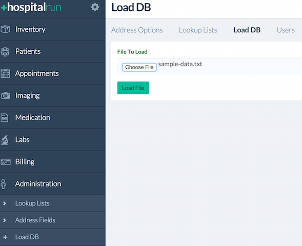

HospitalRun frontend
========

_Ember frontend for HospitalRun_

[](https://travis-ci.org/HospitalRun/hospitalrun-frontend)

[](http://couchdb.apache.org/)

To run the development environment for this frontend you will need to have [Git](https://git-scm.com/), [Node.js](https://nodejs.org), [Ember CLI](http://ember-cli.com/), [Bower](http://bower.io/), and [CouchDB](http://couchdb.apache.org/) installed.

## Contributing

Contributions are welcome via pull requests and issues.  Please see our [contributing guide](https://github.com/hospitalrun/hospitalrun-frontend/blob/master/.github/CONTRIBUTING.md) for more details, including a link to join our project Slack.

## Install
To install the frontend please do the following:

1. Make sure you have installed [Git](https://git-scm.com/book/en/v2/Getting-Started-Installing-Git)
2. Make sure you have installed [Node.js](https://nodejs.org/en/download/). Versions after 0.10.0 should work, but please note if you encounter errors using 5.x it may be necessary to upgrade your npm version. Versions after 3.5.x should work:
    1. `npm install -g npm`
3. Install [ember-cli latest](https://www.npmjs.org/package/ember-cli): `npm install -g ember-cli@latest`.
   Depending on your [npm permissions](https://docs.npmjs.com/getting-started/fixing-npm-permissions) you might need root access to install ember-cli.
4. Install [bower](https://www.npmjs.org/package/bower): `npm install -g bower`
5. Clone this repo with `git clone https://github.com/HospitalRun/hospitalrun-frontend`, go to the cloned folder and run `script/bootstrap`. (*Note: Depending on your [npm permissions](https://docs.npmjs.com/getting-started/fixing-npm-permissions) you might need root access to install PhantomJS2; also, Windows users must run with [Cygwin](http://cygwin.org/)*).
6. Install and configure [CouchDB](http://couchdb.apache.org/)
    1. Download and install CouchDB from http://couchdb.apache.org/#download
    2. Start CouchDB
        1. If you downloaded the installed app, navigate to CouchDB and double-click on the application.
        2. If you installed CouchDB via Homebrew or some other command line tool, launch the tool from the command line
        3. If you're stuck with the installation, check out the instructions published here: http://docs.couchdb.org/en/1.6.1/install/index.html
    3. Verify that CouchDB is running by successfully navigating to 127.0.0.1:5984/_utils. If that fails, check the installation guide for CouchDB http://docs.couchdb.org/en/1.6.1/install/index.html
    4. Create admin user:
        1. If you are running CouchDB 1.x
            1. If you have just installed CouchDB and have no admin user, please run `./script/initcouch.sh` in the folder you cloned the HospitalRun repo.  A user `hradmin` will be created with password: `test`.
            2. If you already have a CouchDB admin user, please run `./script/initcouch.sh USER PASS` in the folder you cloned the HospitalRun repo.  `USER` and `PASS` are the CouchDB admin user credentials.
        2. If you are running CouchDB 2.x
            1. If you have just installed CouchDB and have no admin user, please run `./script/initcouch2.sh` in the folder you cloned the HospitalRun repo.  A user `hradmin` will be created with password: `test`.
            2. If you already have a CouchDB admin user, please run `./script/initcouch2.sh USER PASS` in the folder you cloned the HospitalRun repo.  `USER` and `PASS` are the CouchDB admin user credentials.
7. Copy the `server/config-example.js` to `server/config.js` in the folder you cloned the HospitalRun repo.  If you already had a CouchDB admin user that you passed into the couch script (`./script/initcouch.sh USER PASS`), then you will need to modify the `couchAdminUser` and `couchAdminPassword` values in `server/config.js` to reflect those credentials. (*Note: If on Mac, you need to make sure CouchDB can be run. See [How to open an app from a unidentified developer and exempt it from Gatekeeper](https://support.apple.com/en-us/HT202491).*)
8. Verify that CouchDB is running by visiting: http://127.0.0.1:5984/_utils/#login
   and logging in with the with the credentials you just created from steps 6 and 7.
   1. If you the page returns an error or 404:
     1. Run `make serve`, it will start couchdb, install npm dependencies and start the server.
     2. Or start the application from your applications folder.


## Start
To start the frontend please do the following:

- Start the server by running `npm start` in the repo folder.  If `npm start` doesn't work for you, try `ember serve` as an alternative.
- Go to [http://localhost:4200/](http://localhost:4200/) in a browser and login with username `hradmin` and password `test`.

## Running with Docker
To run HospitalRun with Docker please do the following:
- Goto [https://docs.docker.com/engine/installation](https://docs.docker.com/engine/installation) to download and install Docker.
- Clone the repository with the command `git clone https://github.com/HospitalRun/hospitalrun-frontend.git`.
- Change to the hospitalrun-frontend directory `cd hospitalrun-frontend`.
- Build the HospitalRun image with `docker build -t hospitalrun-frontend .`
- Execute `docker run -it --name couchdb -d couchdb` to create the couchdb container.
- Execute `docker run -it --name hospitalrun-frontend -p 4200:4200 --link couchdb:couchdb -d hospitalrun-frontend` to create the HospitalRun container.

### Accessing HospitalRun with Docker Toolbox
If you are running with Docker Toolbox you will have to run the following commands to get the IP of the docker machine where hospitalrun-frontend is running with the following:
- Run the following command to get the ip of the docker machine that the image was created on `docker-machine ip default`.
- Go to `http://<docker-machine ip>:4200` in a browser and login with username `hradmin` and password `test`.

### Accessing HospitalRun with Docker
If you are not running with docker toolbox please do the following:
- Go to `http://localhost:4200` in a browser and login with username `hradmin` and password `test`.

### Troubleshooting your local environment
Always make sure to `git pull` and get the latest from master.

The app will usually tell you when something needs to happen (i.e. if you try to `npm start` and npm is out of date, it will tell you to run `npm update`. But If you run into problems you can't resolve, feel free to open an issue, or ask for help in the [HospitalRun Slack channel](https://hospitalrun.slack.com/) (you can request an invite [here](https://hospitalrun-slackin.herokuapp.com/)).

Otherwise, here are some tips for common issues:

**The browser shows only a loading dialog**

Is your server (still) running? Is Couch running? If not, that's probably the issue.

**My changes aren't showing up in the browser**

Try a browser refresh `cmd + r`.

## Loading sample data
If you would like to load sample data, you can do so by navigating to **Load DB** under the Administration menu.  You should see the following screen:




Click on ***Choose File*** and select the file **sample-data.txt** which is included in root directory of the repo at [sample-data.txt](sample-data.txt).
Next, click on ***Load File***.  When the database load is complete a message will appear indicating if the load was successful.

## Testing

### Fixtures for Acceptance Tests

Fixtures are PouchDB dumps that are generated with [pouchdb-dump-cli](https://github.com/nolanlawson/pouchdb-dump-cli).

To create a fixture, run `pouchdb-dump http://localhost:5984/main -u hradmin -p test | cat > tests/fixtures/${name_of_fixture}.txt`.

To use a fixture, use `runWithPouchDump(${name_of_fixture}, function(){..});` in your acceptance test. For example,

```js
test('visiting /patients', function(assert) {
  runWithPouchDump('default', function() {
    //Actual test code here
    authenticateUser();
    visit('/patients');
    andThen(function() {
      assert.equal(currentURL(), '/patients');
    });
  });
});
```

### Running Tests Locally

To run the test suite locally while developing, just run `ember test` from the project root.

Tests will also run automatically via Travis CI when you push a branch to the repository or a pull request. You can view output by going to the Travis test status from the Pull Request merge box.

## Contributing

Again, contributions are welcome via pull requests and issues.  Please see our [contributing guide](https://github.com/hospitalrun/hospitalrun-frontend/blob/master/.github/CONTRIBUTING.md) for more details.

**Seriously, please read the [Contribution Guide](https://github.com/hospitalrun/hospitalrun-frontend/blob/master/.github/CONTRIBUTING.md).**

## Start Coding
To start coding and understand the frameworks, concepts and structure of the project, please read: 
[Contribution Guide: Start Coding](.github/CONTRIBUTING.md#start-coding).

## Further Reading / Useful Links

* [ember.js](http://emberjs.com/)
* [ember-cli](http://www.ember-cli.com/)
* Development Browser Extensions
  * [ember inspector for chrome](https://chrome.google.com/webstore/detail/ember-inspector/bmdblncegkenkacieihfhpjfppoconhi)
  * [ember inspector for firefox](https://addons.mozilla.org/en-US/firefox/addon/ember-inspector/)

## Experimental

### Make
If you are willing to try using `make`, ensure you have installed git, node and couchdb (steps 1, 2 and 7 above), you may skip the rest.  This requires couchdb in the path to work correctly.
* Run `make serve`, it will start couchdb, install npm dependencies and start the server.
* Run `make all` to run all tests and build the app.
* Look into `Makefile` to figure other targets available.

### Cloud 9 Development Environment
[Documented in the project wiki](https://github.com/HospitalRun/hospitalrun-frontend/wiki/Optional:-Cloud9-Development-Environment)
